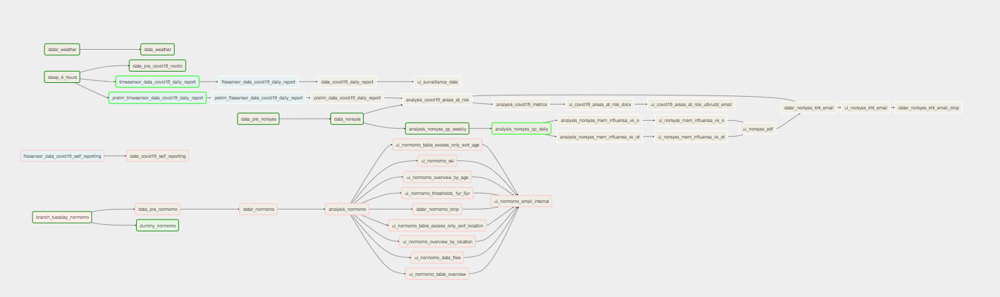

## A new R package

As mentioned in the "Examples" section, schemas need to be added via `sc::add_schema` and tasks need to be added via `sc::add_task`. It is easiest to create a new R package (e.g. `sykdomspulsen`) and include all schema/task creation code in an `onAttach` function (http://r-pkgs.had.co.nz/r.html), which means that any `sykdomspulsen::` call will automatically have all schema/task creation code run automatically.

We then create a function `sykdomspulsen::tm_run_task` which is a wrapper around `sc::tm_run_task`, with all schema/task creation code run automatically.

This means that we can then run tasks from the console (outside of R):

```
RScript -e 'sykdomspulsen::tm_run_task("example_data")'
```

## Airflow

We recommend using https://airflow.apache.org/ to orchestrate tasks.

Here is an example workflow, with each task represented as a rectangle.

